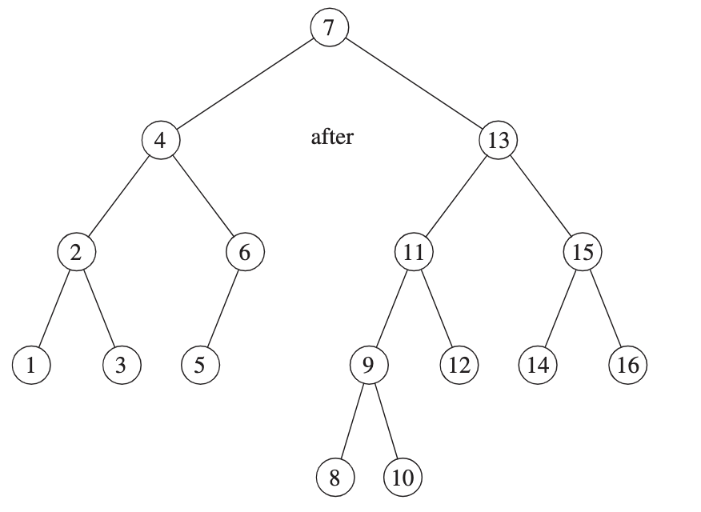

# CS 2C: Advanced Data Struct/ Algorithm in C++
    Foothill College
    Instructor: Mikel Mcdaneil
    Textbook: Data Structres and Algorithm Analysis in C++
    Office Hours: TBA
    Lecture: Asynchronous
    Author: Mokhalad Aljuboori

## Table of Contents
- [CS 2C: Advanced Data Struct/ Algorithm in C++](#cs-2c-advanced-data-struct-algorithm-in-c)
  - [Table of Contents](#table-of-contents)
- [Chapter 3: Lists, Stacks, and Queues](#chapter-3-lists-stacks-and-queues)
  - [3.2 The List ADT](#32-the-list-adt)
  - [3.3 ```list``` vs ```vector```](#33-list-vs-vector)
    - [Iterators](#iterators)
      - [```const_iterators```](#const_iterators)
- [Chapter 4: Trees](#chapter-4-trees)
  - [4.1 Preliminaries](#41-preliminaries)
    - [Implementation of Trees](#implementation-of-trees)
  - [4.2 Binary Trees](#42-binary-trees)
    - [Implementation](#implementation)
  - [4.3 The Search Tree ADT –– Binary Search Trees](#43-the-search-tree-adt--binary-search-trees)
    - [Binary Search Tree Skeleton](#binary-search-tree-skeleton)
    - [`contains`](#contains)
    - [`findMin` and `findMax`](#findmin-and-findmax)
    - [`insert`](#insert)
    - [`remove`](#remove)
    - [Destructor and Copy Constructor](#destructor-and-copy-constructor)
  - [4.4 AVL Trees](#44-avl-trees)
    - [Single Rotation](#single-rotation)
    - [Double Rotation](#double-rotation)
    - [Summary](#summary)
    - [Implementations:](#implementations)
      - [Node Decleration for AVL Trees](#node-decleration-for-avl-trees)
      - [Function to compute height of an AVL node](#function-to-compute-height-of-an-avl-node)
      - [Insert into AVL tree method](#insert-into-avl-tree-method)
      - [balance method](#balance-method)
      - [Single Rotation left-left](#single-rotation-left-left)
      - [Double Rotation left-right](#double-rotation-left-right)
      - [Delete method](#delete-method)
- [Chapter 5: Hashing](#chapter-5-hashing)
  - [5.1 General Idea](#51-general-idea)
  - [5.2 Hash Function](#52-hash-function)
  - [5.3 Separate Chaining](#53-separate-chaining)
- [Chapter 6 Priority Queues (Heaps)](#chapter-6-priority-queues-heaps)
  - [6.1 Model](#61-model)
- [Chapter 7: Sorting](#chapter-7-sorting)
  - [7.5 Heapsort](#75-heapsort)
    - [Implementation](#implementation-1)
  - [7.6 Mergesort](#76-mergesort)
    - [Implementation](#implementation-2)
- [Graphs:](#graphs)
  - [9.3 Shortest-Path Algorithms](#93-shortest-path-algorithms)
    - [Unweighted Graphs](#unweighted-graphs)
      - [Implementation (Pseudocode):](#implementation-pseudocode)
      - [Implemenntation (Pseudocode, using queue)](#implemenntation-pseudocode-using-queue)
    - [Dijkstra's Algorithm](#dijkstras-algorithm)
      - [Implementation (Psuedocode)](#implementation-psuedocode)


# Chapter 3: Lists, Stacks, and Queues

## 3.2 The List ADT

removing the last item in a singly linked list is tricky  because we have to find the next-to-last item, change it's *next* link to **```nullptr```**, and then update the link that maintains the last node. A doubly linked list fixes this problem
    
## 3.3 ```list``` vs ```vector```
THe advanage of using the ```vector``` is that it's indexable in constant time. The disadvantage of using ```vector``` is that insertion of new items and removal of existing items is expensive, unless the changes are made at the end of the vector.

The advaage of using the ```list``` is that insertions of new items and removal of exisitng items is cheap, provided that the position of the changes is known. The disadvantage is that the ```list``` is not easily indexable. **Both ```vector``` and ```list``` are ineffiecint for searches**

### Iterators
besided copying, the most commonly used operations on iteratores include the following
```cpp
itr++
++iter
*iter
iter1 == iter2
iter1 != iter2
```

####  ```const_iterators```
  the main diff between an ```iterator``` and a ```const_iterator``` is that ```operator*``` for ```const_iterator``` returns a constant reference, and this ```*itr``` for a ```const_iterator``` cannot appear on the left-hand side of an assignment statement

</br>

# Chapter 4: Trees

##  4.1 Preliminaries
- a tree is a collection of N nodes, and a tree has N - 1 edges
- Nodes with no children are known as **leaves**
- a **path** from node $n_1$ to $n_k$ is definied as a sequence of nodes $n1, n2, ... , n_k$ such that $n_i$ is the parent of $n_{i + 1}$ for $1 \le i < k$. The **length** of this path is the number of edges on the path, namely, $k - 1$.
- THe **height** of $n_i$ is the length of the longest path from $n_i$ to a leaf. Thus all leaves are at height 0.
- The height of a tree is equal to the height of the root.
- The depth of a tree is euql to the depth of the deepest leaf; this is always equal to the height of the tree.

### Implementation of Trees

Have in each node a link to each child of the node, however since the num of children per node can vary, it would be too much wasted space. A solution would be to **Keep the children of each node in a linked list of tree nodes**
<br> <br>
```cpp
struct TreeNode {
  Object element;
  TreeNode *firstChild;
  TreeNode *nextSibiling;
}
```
**FIgure 4.3** Node declarations for trees


## 4.2 Binary Trees
**Definiton**: A binary tree is a tree in which no node can have more than two children
- The average depth a binary has is $O(\sqrt N)$. Unforutanly,
- And for a binary search tree, the average value of the depth is $O(logN)$
  - The depth can be as large as N - 1


### Implementation

- The decleration of binary search trees is similar in structor to that for doubly linked lists, in that a node is a structure consisting of the **```element```** information plus two pointers (**```left``` and ```right```**)
- when drawing binary search trees, we use circle shapes for the nodes because the BS tree is a graph, we also do not explicity draw ```nullptr```links when referring to trees, because every binary tree with $N$ nodes would require $N + 1$ ```nullptr``` links.

## 4.3 The Search Tree ADT –– Binary Search Trees
**Definiton**: The property that makes a **binary tree** into a **binary search tree** is that for every node, $X$, in the tree, the values of all the items in its left subtree are smaller than the item in $X$, and the values of the items in the right subtree are larger than the item in $X$
</br>


  The left tree is a binary search tree but the tree on the right is not. This is because the tree on the right has a node with item 7 in the left subtree of a node with item 6, (which happens to be the root).

### Binary Search Tree Skeleton
```cpp
1 template <typename Comparable>
2 class BinarySearchTree
3 {
4 public:
5 BinarySearchTree( );
6 BinarySearchTree( const BinarySearchTree & rhs );
7 BinarySearchTree( BinarySearchTree && rhs );
8 ~BinarySearchTree( );
9
10 const Comparable & findMin( ) const;
11 const Comparable & findMax( ) const;
12 bool contains( const Comparable & x ) const;
13 bool isEmpty( ) const;
14 void printTree( ostream & out = cout ) const;
15
16 void makeEmpty( );
17 void insert( const Comparable & x );
18 void insert( Comparable && x );
19 void remove( const Comparable & x );
20
21 BinarySearchTree & operator=( const BinarySearchTree & rhs );
22 BinarySearchTree & operator=( BinarySearchTree && rhs );
23
24 private:
25 struct BinaryNode
26 {
27 Comparable element;
28 BinaryNode *left;
29 BinaryNode *right;
30
31 BinaryNode( const Comparable & theElement, BinaryNode *lt, BinaryNode *rt )
32 : element{ theElement }, left{ lt }, right{ rt } { }
33
34 BinaryNode( Comparable && theElement, BinaryNode *lt, BinaryNode *rt )
35 : element{ std::move( theElement ) }, left{ lt }, right{ rt } { }
36 };
37
38 BinaryNode *root;
39
40 void insert( const Comparable & x, BinaryNode * & t );
41 void insert( Comparable && x, BinaryNode * & t );
42 void remove( const Comparable & x, BinaryNode * & t );
43 BinaryNode * findMin( BinaryNode *t ) const;
44 BinaryNode * findMax( BinaryNode *t ) const;
45 bool contains( const Comparable & x, BinaryNode *t ) const;
46 void makeEmpty( BinaryNode * & t );
47 void printTree( BinaryNode *t, ostream & out ) const;
48 BinaryNode * clone( BinaryNode *t ) const;
49 };
```

### `contains`
This operation retures `true` if there is a node in tree $T$ that has item $X$ or `false` if there is no such node. If the tree is empty we just return `false`, otherwise we just recursivly call on a subtree T, either left or right, depending on the relationship of $X$ to the item stored in $T$.

Implementation:

```cpp
/**
 * Internal method to test if an item is in a subtree.
 * x is item to search for.
 * t is the node that roots the subtree.
 */
 bool contains( const Comparable & x, BinaryNode *t ) const {
 if( t == nullptr )
    return false;
 else if( x < t->element )
    return contains( x, t->left );
 else if( t->element < x )
    return contains( x, t->right );
 else
    return true; // Match
 }
```

- It is curcial to test for an empty to be preformed first, since otherwise, we would gernerate a run time error attempting to access a data member through a `nullptr`.

 <br>
 <br>

### `findMin` and `findMax` 
These `private` routines return a pointer to the node containing the smallest and largest elements in the tree, respectively.
- `findMin`
  - Start at the root and go left as long as there is a left child. The stopping point is the smallest element
- `findMax` 
  - same idea except branching is to the right child.

Implementations:

```cpp
 /**
 * Internal method to find the smallest item in a subtree t.
 * Return node containing the smallest item.
 */
 BinaryNode * findMin( BinaryNode *t ) const {
 if( t == nullptr )
     return nullptr;
 if( t->left == nullptr )
     return t;
 return findMin( t->left );
 }
```

```cpp
 /**
 * Internal method to find the largest item in a subtree t.
 * Return node containing the largest item.
 */
 BinaryNode * findMax( BinaryNode *t ) const {
 if( t != nullptr )
     while( t->right != nullptr )
       t = t->right;
 return t;
 }
```

### `insert`
To insert $X$ into a tree $T$, proceed down the tree as you would with a `contains.` if $X$ is found, do nothing. Otherwise, insert $X$ at the last spot on the path traversed. 

**Implementation:**
```cpp
 /**
 * Internal method to insert into a subtree.
 * x is the item to insert.
 * t is the node that roots the subtree.
 * Set the new root of the subtree.
 */
 void insert( const Comparable & x, BinaryNode *&t)
 {
 if( t == nullptr )
    t = new BinaryNode{ x, nullptr, nullptr };
 else if( x < t->element )
    insert( x, t->left );
 else if( t->element < x )
 i    nsert( x, t->right );
 else
    ; // Duplicate; do nothing
 }

 /**
 * Internal method to insert into a subtree.
 * x is the item to insert by moving.
 * t is the node that roots the subtree.
 * Set the new root of the subtree.
 */
 void insert( Comparable && x, BinaryNode *&t)
 {
 if( t == nullptr )
    t = new BinaryNode{ std::move( x ), nullptr, nullptr };
 else if( x < t->element )
    insert( std::move( x ), t->left );
 else if( t->element < x )
    insert( std::move( x ), t->right );
 else
    ; // Duplicate; do nothing
}
Figure 4.23 Insertion into a binary search tree
```

### `remove`
- if a node is a leaf, it can be deleted immediatley
- if the node has one child, the node can be deleted after it's parent adjusts a link to bypass the code

- The complicated case deals with a node with two children.

The general strategy for this deletion is to replace the data of the node with the smallest data of the **right subtree** and recursively delete that node.\
Because the smallest node in the right subtree cannot have a left child, the second `remove` is an easy one.
- 

**Lazy deletion**: if the num of deletions is expected to be small, then a popular strategy to use is **Lazy deletion**: When an element is to be deleted, it is left in the tree and merely *marked* as being deleted.

<br>

### Destructor and Copy Constructor
- destructor calls `makeEmpty`
- Copy constructor first initializes `root` to `nullptr` and then make a copy of `rhs`

**Implementation:**
- Destructor
    - 
- Constructor
    - 

## 4.4 AVL Trees
**Definition:** An AVL Tree is idential to a BST, except that for every node in the tree, the height of the left and right subtrees can differ by at most 1. (The hegith of an empty tree is defined to be -1.)
- It's a BST with a **balacning conditon** which ensures that the depth of the tree is $O(logN)$
- Another balacing condtion would insist that every node must have left and right sub-trees of the same height. IF the ehgith of an empty subtree is defnied to be -1, then only perfectly balances tree of $2^k - 1$ nodes would satisfy this crietion.
- The minimum number of nodes, $S(h)$, in an AVL tree of height $h$ is given by $S(h) = S(h-1) + S(h - 2) + 1$ for $h =0, S(h) = 1$. For $h = 1, S(h) = 2$
- All tree opertaions can be preformed in O(logN) time, except possibly insertion and deletion.


Suppose node $\alpha$ needs a rebalanced. Since $\alpha$ has a height imbalance, it requires that $\alpha$'s two subtrees' heights differ by two.\
**A violation might occur in four cases.**
1. An insertion into the left subtree of the left child of $\alpha$
2. an insertion into the right subtree of the left child of $\alpha$
3. an insertion into the left subtree of the right child of $\alpha$
4. an insertion into the right subtree of the right child of $\alpha$
  
Case 1 and 3 are mirrior images symmetries with respect to $\alpha$, this is fixed by a **single rotation**\
Case 2 and 3 are also mirrior image symmetries with respect to $\alpha$,
this is fixed by a **double rotation**
### Single Rotation
Before picture on the left, after picture on the right.
- Node $k_2$ violates the avl balance property because its left subtree is two level deeper than it's right subtree.
- To ideally rebalance the tree, we would live to move X up a level and Z down a level.  note this is actually more than the AVL property would require.
- We need to remember that the rest of the tree has to be informed of this change. Here this means the root is updated to be $k_1$, $k_2$ right child must be reset to link to Y instead of $k_1$ and etc.
- Note that the new height of the tree is exactly the same as the height of the original subtree prior to the insertion that caused X to grow.


### Double Rotation
The fact that subtree Y has an item inserted into it guarantees that it is nonempty. Thus, we may assume that it has a root and two subtrees. As the diagram below shoes, exactly one of tree B or C is two level deeper than D. But we cannot be sure which one it is.
- Turns out it does not matter.
- To fix the imbalance, we take the root of the tree Y which is causing the imbalance and place that as the new node where the imbalance is. Leaving it's children behind and giving them to $k_1$ and $k_3$
- The new left and right child's of $k_2$ is $k_1$ and $k_3$ respectively.
  - **As we can see, it restores the height what it was before the insertion**
    - 

**More Examples:**
- right-left double rotation
  - insertion of 15 causes height imbalance at node 7.
    - 

\
.
- right-left double rotation
  - insertion of 14 causes height imbalance at node 6.
    - 

\
.
- right-right **single rotation**
  - insertion of 13 causes imbalance at the root 4.

    - 

\
.
- left-left **single rotation**
  - insertion of 12 causes imbalance at node 14.
    - 

\
- .
  - left-right double rotation
    - insertion of 9, (becomes the right child of 8) causes imbalance at node 10
      -   
      - 

### Summary
To insert a new node with item $X$ into an AVL tree $T$, we recursively inert $X$ into the appropriate subtree of $T$ (let us cal this $T_{LR}$). if the height of $T_{LR}$ does not change, then we are done. Otherwise, if a height imbalance apprears in $T$, we do the appropriate single or double rotation depending on $X$ and the items in $T$ and $T_{LR}$, update the heights, and we are done.


### Implementations:
#### Node Decleration for AVL Trees
```cpp
struct AvlNode {
Comparable element;
AvlNode *left;
AvlNode *right;
int height;

AvlNode( const Comparable & ele, AvlNode *lt, AvlNode *rt, int h = 0 )
: element{ ele }, left{ lt }, right{ rt }, height{ h } { }

 AvlNode( Comparable && ele, AvlNode *lt, AvlNode *rt, int h = 0 )
 : element{ std::move( ele ) }, left{ lt }, right{ rt }, height{ h } { }
 };
```

#### Function to compute height of an AVL node
```cpp
 /**
 * Return the height of node t or -1 if nullptr. 3 */

 int height( AvlNode *t ) const {
 return t == nullptr ? -1 : t->height;
 }
```

#### Insert into AVL tree method
```cpp
 /**
 * Internal method to insert into a subtree.
 * x is the item to insert.
 * t is the node that roots the subtree.
 * Set the new root of the subtree.
 */
 void insert( const Comparable & x, AvlNode * & t ) { 
    if( t == nullptr )
        t = new AvlNode{ x, nullptr, nullptr };
    else if( x < t->element )
        insert( x, t->left );
    else if( t->element < x )
        insert( x, t->right );

    balance( t );
  }
```

#### balance method
```cpp
static const int ALLOWED_IMBALANCE = 1;
// Assume t is balanced or within one of being balanced
void balance( AvlNode * & t ) {
  if( t == nullptr )
    return;

  if( height( t->left ) - height(t->right) > ALLOWED_IMBALANCE ) {
    if( height( t->left->left ) >= height( t->left->right ) ) {
      rotateWithLeftChild( t );
    } else {
      doubleWithLeftChild( t );
    }
  } else {
    if( height( t->right ) - height( t->left ) > ALLOWED_IMBALANCE ) {
      if( height( t->right->right ) >= height( t->right->left ) ) {
        rotateWithRightChild( t );
      } else {
        doubleWithRightChild( t );
      }
    }
    t->height = max( height( t->left ), height( t->right ) ) + 1;
  }
}
```

#### Single Rotation left-left
```cpp
/**
 * Rotate binary tree node with left child.
 * For AVL trees, this is a single rotation for case 1.
 * Update heights, then set new root.
 */
void rotateWithLeftChild( AvlNode * & k2 ) {
  AvlNode *k1 = k2->left;
  k2->left = k1->right;
  k1->right = k2;
  k2->height = max( height( k2->left ), height( k2->right ) ) + 1;
  k1->height = max( height( k1->left ), k2->height ) + 1;
  k2 = k1;
}
```

#### Double Rotation left-right
```cpp
/**
* Double rotate binary tree node: first left child
* with its right child; then node k3 with new left child.
* For AVL trees, this is a double rotation for case 2.
* Update heights, then set new root.
*/
void doubleWithLeftChild( AvlNode * & k3 ) {
  rotateWithRightChild( k3->left );
  rotateWithLeftChild( k3 );
}
```

#### Delete method
```cpp
/**
* Internal method to remove from a subtree.
* x is the item to remove.
* t is the node that roots the subtree.
* Set the new root of the subtree.
*/
void remove( const Comparable & x, AvlNode * & t ) {
  if(t == nullptr )
  return;   // Item not found; do nothing


  if( x < t->element) {
    remove( x, t->left );
  } else if( x > t->element ) {
    remove( x, t->right );
  } else if( t->left != nullptr && t->right != nullptr ) { // Two children 
    t->element = findMin( t->right )->element;
    remove( t->element, t->right );
  } else {
    AvlNode *oldNode = t;
    t = ( t->left != nullptr ) ? t->left : t->right;
    delete oldNode;
  }

  balance( t );
 }
```

# Chapter 5: Hashing
## 5.1 General Idea
- hashing is a technique used for performing insertions, deletions, and finds in constant average time.
- The mapping is called a **hash function**, and should ensure that any two distinct keys get different cells.
- a **collision** is when two keys hash to the same value

## 5.2 Hash Function
- it is often a good idea to ensure that the table size is prime.
- Fig 5.3 distrubites evenly if the input key is random, however, english is not random. Therefore this hash function is not approtiate if the hash table is reasonably large.
- Fig 5.4 is a good hash function and it uses horners rule to compute a polynomial function of 37
  - The issue is that this function would take a long time to compute if key is large. Therefore, some programmers implement their hash functions using only the characters in the odd spaces, or if the key is a street address, they might take some characters from the city name, zipcode and street address instead of the entire key


## 5.3 Separate Chaining
- the strat is to keep a `std::list` of all elements that hash to the same value.
- 
- to preform a **search**, we use the hash function to determine which list to traverse
- to preform an **insert**, we check the approriate list to see whether the elemt is already in place, (if duplicates exist, usually an extra data member is usually kept and that is incremented in the event of a match). If the element is new, it can be insereted at the front of the list.


# Chapter 6 Priority Queues (Heaps)
similar to a queue data structure, a priority que process the thing of most importance first.

## 6.1 Model
- A Priority Queue is a data structure that allows at least the following two operations, insert and deleteMin. `deleteMin` is the priority queue equivalent of the queue's `dequeue` operation.

  


# Chapter 7: Sorting
## 7.5 Heapsort
- priority queues can be used to sort in $\mathcal O(NlogN)$
  - we need to build a binary heap of $N$ elements. – This takes $\mathcal O(N)$
  - we then perform $N$ `deleteMax` operations. The elements leave the heap max first, so we record these elements in a second array, we sort $N$ elements.
    -  Each `deleteMax` takes $\mathcal O(logN)$ time, so the total running time is $\mathcal O(NlogN)$
 - a problem with this algorithm is we we create another array, so now the memory required is doubled.
 - a clever way around to not use a second array is to make us of the fact that everytime you call `deleteMax`, the heap shrinks by 1. So you can just place the deleteMax element at the end of the heap. The next deleted elment will go in the second to last position, and so on.

### Implementation
```cpp

/**
 * Internal method for heapsort.
 * i is the index of an item in the heap.
 * Returns the index of the left child.
 */
inline int leftChild( int i ) {
  return 2 * i + 1;
}


/**
 * Standard heapsort.
 */
template <typename Comparable>
void heapsort( vector<Comparable> & a )
  for(int i = a.size() / 2 - 1; i >= 0; --i) {/*buildHeap*/ 
    percDown( a, i, a.size( ) );        
  } 
  for(intj = a.size() - 1; j > 0 ; --j) {     /*deleteMax*/
      std::swap( a[ 0 ], a[ j ] );      
      percDown( a, 0, j );
  }
}


/**
 * Internal method for heapsort that is used in deleteMax and buildHeap.
 * i is the position from which to percolate down.
 * n is the logical size of the binary heap.
 */
template <typename Comparable>
void percDown( vector<Comparable> & a, int i, int n ) {
  int child;
  Comparable tmp;
  
  for( tmp = std::move( a[i] ); leftChild( i ) < n; i = child ) {
    child = leftChild( i );
    if ( child != n - 1 && a[ child ] < a[ child + 1] )
      ++child;
    if (tmp < a[ child ])
      a [ i ] = std::move( a[ child ]);
    else 
      break;
  }
  a[ i ] = std::move( tmp ); 
}
```
<hr>

## 7.6 Mergesort
- Mergesort runs in $\mathcal O(NlogN)$ worst-case running time, and the number of comparisons used is nearly optimal.
- The basic merging algorithm takes two sorted input arrays A and B, then outputs array C, and three counters, `Actr,` `Bctr`, `Cctr`, which are initially set to the beginning of their respective arrays.
- the smaller of `A[Actr]` and `B[Bctr]`is copied to the next entry in C, and the appropriate counters are advanced.
here is an example:\


- **Mergesort Algorithm:**
  - if $N$ = 1, the list is already sorted since there is just 1 element.
  - Otherwise, recursively mergesort the firsthalf and the second half. This gives two sorted halves, which can then be merged together using the mergin algorithm described above.
  - This algorithm is a classic *divide-and-conquer* strategy – The problem is *divided* intosmaller problems and solved recursively.
  - The *conquering phase consit of patching together the answers.

### Implementation

```cpp
/**
* Mergesort algorithm (driver).
*/
template <typename Comparable>
void mergeSort( vector<Comparable> & a ) {
  vector<Comparable> tmpArray( a.size( ) );
  
  mergeSort( a, tmpArray, 0, a.size( ) - 1 );
}


 /**
 * Internal method that makes recursive calls.
 * a is an array of Comparable items.
 * tmpArray is an array to place the merged result.
 * left is the left-most index of the subarray.
 * right is the right-most index of the subarray.
 */

 template <typename Comparable>
 void mergeSort( vector<Comparable> & a,
                  vector<Comparable> & tmpArray, int left, int right )
{
  if( left < right ) {
  int center = ( left + right ) / 2;
  mergeSort( a, tmpArray, left, center );
  mergeSort( a, tmpArray, center + 1, right );
  merge( a, tmpArray, left, center + 1, right );
  }
}
```

# Graphs:
- a directed graph is a one way edge from node u to v
- an undirected graph is a two way edge from node u to v.
- a mixed graph has both undirected and directed edges.
- two vertices are said to be **adjacent** if there is an edge whose end vertices are *u* and *v*.
- an edge is said to be **incident** on a vertex if the vertex is one of the edge's endpoints.
- the degree of vertex v, denoted $deg(v)$ is the number of incident edges of v.
- an edge that connects a vertex to itself is called a self-loop
  - a graph that does not contain self-loops or parallel edges is said to be a **simple graph**
  - For a simple graph, we can say that the edges are a set of vertex pairs (and not just a collection)


<hr>

## 9.3 Shortest-Path Algorithms

### Unweighted Graphs 
**Breadth-first search** operates by processing vertices in layers. The vertices closest to the start are evaluated first, and then most distant vertices are evaluated last.
- For each vertex, we will keep track of three pieces of information
1) keep it's distance from s in the entry $d_v$. Initially all vertices are unreachable except for s, whose path length is 0. 
2) The entry $p_v$ is the bookkeeping variable, which will allow us to print the actual paths. 
3) The entry *known* is set to `true` after a vertex is processed. Initially all entries are not *known*, including the start vertex. When a vertex is marked *known*, we have a guarantee that no cheaper path will ever be found, so processing for that vertex is essentially complete.

#### Implementation (Pseudocode):
```cpp
void Graph::unweighted( Vertex s ) { // s is the start vertex
  for each Vertex v {
      v.dist = INFINITY;
      v.known = false;
  }

  s.dist = 0;
  
  for ( int currDist = 0; currDist < NUM_VERTICES; ++currDist ) {
    for each Vertex v {
      if ( !v.known && v.dist == currDist) {
        v.known = true;
        for each Vertex w adjacent to v {
          if ( w.dist == INFINITY ) {
            w.dist = currDist + 1;
            w.path = v;
          }
        }
      }
    }
  }
  
} 

```
<hr> 

- The running time of the algorithm is $\mathcal O(|V|^2)$, because of the doubly nested for loops.  
- An obvious inefficenty is that the outside loop contunies until `NUM_VERTICES - 1`, even if all the vertices become *known* much earlier. An extra test could made to avoid this, but it does not affect the worst-case running time.

#### Implemenntation (Pseudocode, using queue)
```cpp
void Graph::unweighted( Vertex s ) {
  Queue<Vertex> q;
  
  for each Vertex v
    v.dist = INFINITY;
  
  s.dist = 0;
  q.enqueue( s );

  while ( !q.isEmpty() ) {
    Vertex v = q.dequeue();

    for each Vertex w adjacent to v
      if ( w.dist == INFINITY ) {
        w.dist = v.dist + 1;
        w.path = v;
        q.enqueue( w );
      }
  } 
}
```
<hr>

### Dijkstra's Algorithm
- if the graph is weighted the problem (apparently) becoes harder, but we can still use the ideas from the unweighted case.
- We keep all of the sameinformation as before – each vertex is marked as either *known* or *unknown*. A tentative distance $d_v$ is kept for each vertex, as before. This distance turns out to be the shortest path length from *s* to *v* using only *known* vertices, as before. As before, we record $p_v$, which is the last vertex to cause a change to $d_v$.
- **Dijkstra's Algorithm** is an example of a **greedy algorithm.**
  - Greedy algorithm generally solve a problem in stages by doing what appears to be the best thing at each stage.
  
  - The update operation is known as a relaxtion procedure, because it takes an old estimate and checks if it can be improved to get closer to its true value.

**Edge Relaxtion:**
$$
\text{if}\; D[u] + w((u, z)) < D[z] \;\bold{\text{then}}\\
D[z] \leftarrow D[u] + w((u,z))
$$

**Proposition:* * *in Dijkstra's algorith, whenever a vertex u is pulled into the cloud, the label D[u] is equal to d(v.u), the length of a shortest path from v to u.*

#### Implementation (Psuedocode)
```md
Algorithm ShortestPath( G, v):
  /*
  Input: A simple undirected weighted graph G with nonnegative edge weights and a distinguished vertex v of G.

  Output: a label D[u], for each vertex u of G, such that D[u] is the length of a shortest path from v to u in G
  */

  Initialize D[v] <- to 0 and D[u] <- +∞ for each vertex u ≠ v.
  Let a priority queue Q contain all the vertices of G using the D labels as keys.
  
  While Q.isnotempty() {
    pull a new vertex u into the cloud
    u <- Q.removeMin()
    
    for each vertex z adjacent to u such that z is in Q {
      {preform the relaxation procedure on edge (u, z)}
      if D[u] + w((u,z)) < D[z] {
        D[z] <- D[u] + w((u,z))
        change to D[z] the key of vertez z in Q.
      }
  }
  return the label D[u] of each vertex u.
  
```