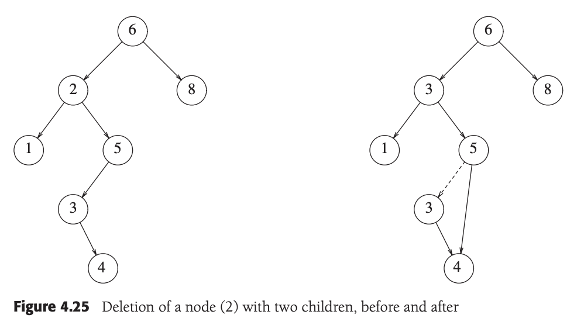

# CS 2C: Advanced Data Struct/ Algorithm in C++
    Foothill College
    Instructor: Mikel Mcdaneil
    Textbook: Data Structres and Algorithm Analysis in C++
    Office Hours: TBA
    Lecture: Asynchronous
    Author: Mokhalad Aljuboori

## Table of Contents
- [CS 2C: Advanced Data Struct/ Algorithm in C++](#cs-2c-advanced-data-struct-algorithm-in-c)
  - [Table of Contents](#table-of-contents)
- [Chapter 3: Lists, Stacks, and Queues](#chapter-3-lists-stacks-and-queues)
  - [3.2 The List ADT](#32-the-list-adt)
  - [3.3 ```list``` vs ```vector```](#33-list-vs-vector)
    - [Iterators](#iterators)
      - [```const_iterators```](#const_iterators)
- [Chapter 4: Trees](#chapter-4-trees)
  - [4.1 Preliminaries](#41-preliminaries)
    - [Implementation of Trees](#implementation-of-trees)
  - [4.2 Binary Trees](#42-binary-trees)
    - [Implementation](#implementation)
  - [4.3 The Search Tree ADT –– Binary Search Trees](#43-the-search-tree-adt--binary-search-trees)
    - [Binary Search Tree Skeleton](#binary-search-tree-skeleton)
    - [`contains`](#contains)
    - [`findMin` and `findMax`](#findmin-and-findmax)
    - [`insert`](#insert)
    - [`remove`](#remove)
    - [Destructor and Copy Constructor](#destructor-and-copy-constructor)


# Chapter 3: Lists, Stacks, and Queues

## 3.2 The List ADT

removing the last item in a singly linked list is tricky  because we have to find the next-to-last item, change it's *next* link to **```nullptr```**, and then update the link that maintains the last node. A doubly linked list fixes this problem
    
## 3.3 ```list``` vs ```vector```
THe advanage of using the ```vector``` is that it's indexable in constant time. The disadvantage of using ```vector``` is that insertion of new items and removal of existing items is expensive, unless the changes are made at the end of the vector.

The advaage of using the ```list``` is that insertions of new items and removal of exisitng items is cheap, provided that the position of the changes is known. The disadvantage is that the ```list``` is not easily indexable. **Both ```vector``` and ```list``` are ineffiecint for searches**

### Iterators
besided copying, the most commonly used operations on iteratores include the following
```cpp
itr++
++iter
*iter
iter1 == iter2
iter1 != iter2
```

####  ```const_iterators```
  the main diff between an ```iterator``` and a ```const_iterator``` is that ```operator*``` for ```const_iterator``` returns a constant reference, and this ```*itr``` for a ```const_iterator``` cannot appear on the left-hand side of an assignment statement

</br>

# Chapter 4: Trees

##  4.1 Preliminaries
- a tree is a collection of N nodes, and a tree has N - 1 edges
- Nodes with no children are known as **leaves**
- a **path** from node $n_1$ to $n_k$ is definied as a sequence of nodes $n1, n2, ... , n_k$ such that $n_i$ is the parent of $n_{i + 1}$ for $1 \le i < k$. The **length** of this path is the number of edges on the path, namely, $k - 1$.
- THe **height** of $n_i$ is the length of the longest path from $n_i$ to a leaf. Thus all leaves are at height 0.
- The height of a tree is equal to the height of the root.
- The depth of a tree is euql to the depth of the deepest leaf; this is always equal to the height of the tree.

### Implementation of Trees

Have in each node a link to each child of the node, however since the num of children per node can vary, it would be too much wasted space. A solution would be to **Keep the children of each node in a linked list of tree nodes**
<br> <br>
```cpp
struct TreeNode {
  Object element;
  TreeNode *firstChild;
  TreeNode *nextSibiling;
}
```
**FIgure 4.3** Node declarations for trees


## 4.2 Binary Trees
**Definiton**: A binary tree is a tree in which no node can have more than two children
- The average depth a binary has is $O(\sqrt N)$. Unforutanly,
- And for a binary search tree, the average value of the depth is $O(logN)$
  - The depth can be as large as N - 1


### Implementation

- The decleration of binary search trees is similar in structor to that for doubly linked lists, in that a node is a structure consisting of the **```element```** information plus two pointers (**```left``` and ```right```**)
- when drawing binary search trees, we use circle shapes for the nodes because the BS tree is a graph, we also do not explicity draw ```nullptr```links when referring to trees, because every binary tree with $N$ nodes would require $N + 1$ ```nullptr``` links.

## 4.3 The Search Tree ADT –– Binary Search Trees
**Definiton**: The property that makes a **binary tree** into a **binary search tree** is that for every node, $X$, in the tree, the values of all the items in its left subtree are smaller than the item in $X$, and the values of the items in the right subtree are larger than the item in $X$
</br>


  The left tree is a binary search tree but the tree on the right is not. This is because the tree on the right has a node with item 7 in the left subtree of a node with item 6, (which happens to be the root).

### Binary Search Tree Skeleton
```cpp
1 template <typename Comparable>
2 class BinarySearchTree
3 {
4 public:
5 BinarySearchTree( );
6 BinarySearchTree( const BinarySearchTree & rhs );
7 BinarySearchTree( BinarySearchTree && rhs );
8 ~BinarySearchTree( );
9
10 const Comparable & findMin( ) const;
11 const Comparable & findMax( ) const;
12 bool contains( const Comparable & x ) const;
13 bool isEmpty( ) const;
14 void printTree( ostream & out = cout ) const;
15
16 void makeEmpty( );
17 void insert( const Comparable & x );
18 void insert( Comparable && x );
19 void remove( const Comparable & x );
20
21 BinarySearchTree & operator=( const BinarySearchTree & rhs );
22 BinarySearchTree & operator=( BinarySearchTree && rhs );
23
24 private:
25 struct BinaryNode
26 {
27 Comparable element;
28 BinaryNode *left;
29 BinaryNode *right;
30
31 BinaryNode( const Comparable & theElement, BinaryNode *lt, BinaryNode *rt )
32 : element{ theElement }, left{ lt }, right{ rt } { }
33
34 BinaryNode( Comparable && theElement, BinaryNode *lt, BinaryNode *rt )
35 : element{ std::move( theElement ) }, left{ lt }, right{ rt } { }
36 };
37
38 BinaryNode *root;
39
40 void insert( const Comparable & x, BinaryNode * & t );
41 void insert( Comparable && x, BinaryNode * & t );
42 void remove( const Comparable & x, BinaryNode * & t );
43 BinaryNode * findMin( BinaryNode *t ) const;
44 BinaryNode * findMax( BinaryNode *t ) const;
45 bool contains( const Comparable & x, BinaryNode *t ) const;
46 void makeEmpty( BinaryNode * & t );
47 void printTree( BinaryNode *t, ostream & out ) const;
48 BinaryNode * clone( BinaryNode *t ) const;
49 };
```

### `contains`
This operation retures `true` if there is a node in tree $T$ that has item $X$ or `false` if there is no such node. If the tree is empty we just return `false`, otherwise we just recursivly call on a subtree T, either left or right, depending on the relationship of $X$ to the item stored in $T$.

Implementation:

```cpp
/**
 * Internal method to test if an item is in a subtree.
 * x is item to search for.
 * t is the node that roots the subtree.
 */
 bool contains( const Comparable & x, BinaryNode *t ) const {
 if( t == nullptr )
    return false;
 else if( x < t->element )
    return contains( x, t->left );
 else if( t->element < x )
    return contains( x, t->right );
 else
    return true; // Match
 }
```

- It is curcial to test for an empty to be preformed first, since otherwise, we would gernerate a run time error attempting to access a data member through a `nullptr`.

 <br>
 <br>

### `findMin` and `findMax` 
These `private` routines return a pointer to the node containing the smallest and largest elements in the tree, respectively.
- `findMin`
  - Start at the root and go left as long as there is a left child. The stopping point is the smallest element
- `findMax` 
  - same idea except branching is to the right child.

Implementations:

```cpp
 /**
 * Internal method to find the smallest item in a subtree t.
 * Return node containing the smallest item.
 */
 BinaryNode * findMin( BinaryNode *t ) const {
 if( t == nullptr )
     return nullptr;
 if( t->left == nullptr )
     return t;
 return findMin( t->left );
 }
```

```cpp
 /**
 * Internal method to find the largest item in a subtree t.
 * Return node containing the largest item.
 */
 BinaryNode * findMax( BinaryNode *t ) const {
 if( t != nullptr )
     while( t->right != nullptr )
       t = t->right;
 return t;
 }
```

### `insert`
To insert $X$ into a tree $T$, proceed down the tree as you would with a `contains.` if $X$ is found, do nothing. Otherwise, insert $X$ at the last spot on the path traversed. 

**Implementation:**
```cpp
 /**
 * Internal method to insert into a subtree.
 * x is the item to insert.
 * t is the node that roots the subtree.
 * Set the new root of the subtree.
 */
 void insert( const Comparable & x, BinaryNode *&t)
 {
 if( t == nullptr )
    t = new BinaryNode{ x, nullptr, nullptr };
 else if( x < t->element )
    insert( x, t->left );
 else if( t->element < x )
 i    nsert( x, t->right );
 else
    ; // Duplicate; do nothing
 }

 /**
 * Internal method to insert into a subtree.
 * x is the item to insert by moving.
 * t is the node that roots the subtree.
 * Set the new root of the subtree.
 */
 void insert( Comparable && x, BinaryNode *&t)
 {
 if( t == nullptr )
    t = new BinaryNode{ std::move( x ), nullptr, nullptr };
 else if( x < t->element )
    insert( std::move( x ), t->left );
 else if( t->element < x )
    insert( std::move( x ), t->right );
 else
    ; // Duplicate; do nothing
}
Figure 4.23 Insertion into a binary search tree
```

### `remove`
- if a node is a leaf, it can be deleted immediatley
- if the node has one child, the node can be deleted after it's parent adjusts a link to bypass the code

- The complicated case deals with a node with two children.

The general strategy for this deletion is to replace the data of the node with the smallest data of the **right subtree** and recursively delete that node.\
Because the smallest node in the right subtree cannot have a left child, the second `remove` is an easy one.
- 

**Lazy deletion**: if the num of deletions is expected to be small, then a popular strategy to use is **Lazy deletion**: When an element is to be deleted, it is left in the tree and merely *marked* as being deleted.

<br>

### Destructor and Copy Constructor
- destructor calls `makeEmpty`
- Copy constructor first initializes `root` to `nullptr` and then make a copy of `rhs`

**Implementation:**
- Destructor
    - 
- Constructor
    - 

